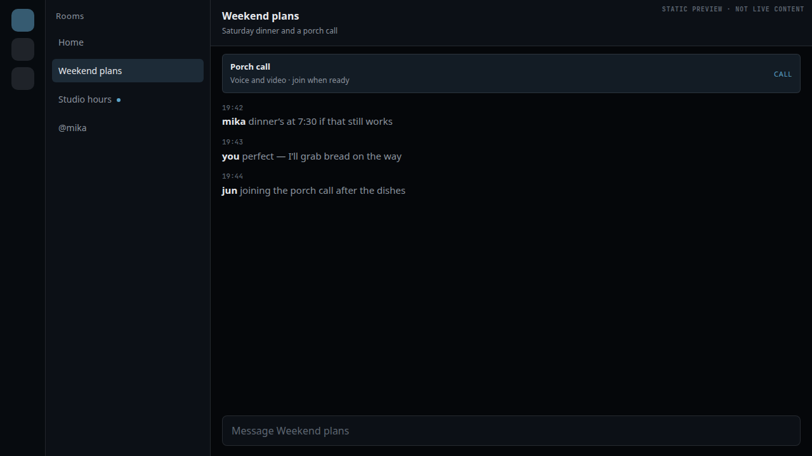
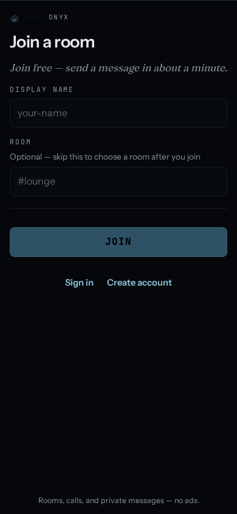

# Onyx

Onyx is a browser-first IRC client for the **Onyx Server** network: fast text
chat, local-first history, end-to-end encrypted direct messages, and realtime
voice/video through the Cadence media stack.

The live first-party network is available at [eshmaki.me](https://eshmaki.me/).
This repository contains the SolidJS client. The daemon is maintained in the
separate [Onyx Server repository](https://github.com/devinkbrown/onyx-server).

Onyx is released under the [GNU Affero General Public License v3.0 or later](LICENSE).
The source is public, while the hosted network remains a separately operated
service. See [`NOTICE.md`](NOTICE.md) for the project and licensing boundary.

## Why Onyx

Onyx keeps the openness and interoperability of IRC while giving a web client
the conveniences people expect from a modern conversation app:

- **Open wire, modern shell.** IRCv3 and IRCX run over WebSocket, with CAP
  negotiation, SASL, session resume, reconnect, and mesh-aware node selection.
- **Memory that stays with you.** Conversation history is retained in the
  browser's IndexedDB vault, with device-local exact, related-term, and hybrid
  search. The default bound is 400 messages per target and can be adjusted by
  the user.
- **End-to-end encrypted direct messages.** The wired DM path seals before
  socket admission, handles device-key changes and multi-device fan-out, fails
  closed when a ciphertext cannot be opened, and never writes decrypted bodies
  to the history vault.
- **Cadence media.** Voice and video are first-class conversation surfaces,
  with device controls, captions, spatial audio, quality feedback, and an
  explicit security state rather than an unconditional privacy claim.
- **A useful return path.** Home catch-up, unread boundaries, followed rooms,
  rich invite links, time-based jumps, pins, drafts, notifications, and a
  command palette make a returning browser session understandable.
- **A real web app.** The client is a responsive installable PWA with themes,
  reduced-motion/data preferences, keyboard navigation, and layouts tested at
  narrow widths and high zoom.

## Current status

The client is active software, not a finished protocol specification. The
following table is intentionally conservative:

| Surface | Status | Notes |
| --- | --- | --- |
| IRC/IRCX text chat | Available | WebSocket transport, CAP/IRCv3, SASL, reconnect, and session resume. |
| Local history and search | Available | Browser-local IndexedDB vault; see [`docs/search-and-history.md`](docs/search-and-history.md). |
| E2EE direct messages | Implemented | Device keys, TOFU/key-change handling, multi-device fan-out, and fail-closed open/seal behavior are wired in `src/lib/e2ee/` and the store. The connected server still has to publish the peer-key contract. |
| Cadence voice/video and media E2EE | Implemented | Media capability and the actual negotiated security state remain visible in the UI. |
| Passkeys | Server-gated | The client supports the WebAuthn ceremony; the connected server must expose `WEBAUTHN`. |
| Group E2EE | Staged | Control-record foundations exist; full room key installation and production acceptance are not claimed. See [`docs/protocol/group-e2ee-c1.md`](docs/protocol/group-e2ee-c1.md). |
| Self-hosted deployment | Buildable | Point the client at your own Onyx Server with `VITE_IRC_WS`; the first-party `deploy.sh` is host-specific. |

The code and tests are the source of truth. Roadmap documents are historical
planning material and may describe work before or after the current checkout.

## Screenshots





## Run the client locally

### Requirements

- Node.js 20 or newer.
- [pnpm](https://pnpm.io/) — this repository intentionally uses pnpm, not npm
  or yarn.
- A reachable Onyx Server WebSocket endpoint for connected chat. The default
  build probes the first-party mesh nodes; a local build can pin another node.

### Install and start

```bash
git clone https://github.com/devinkbrown/onyx.git
cd onyx
pnpm install
cp .env.example .env.local
pnpm dev
```

Open [http://localhost:3000](http://localhost:3000). A build with no
`VITE_IRC_WS` probes the configured public nodes and attaches to the fastest
reachable one. To use a different server, set `VITE_IRC_WS` in `.env.local`;
Vite reads `VITE_*` values at build/dev-server startup, so restart after
changing them.

For the full configuration table, endpoint expectations, media upload boundary,
and static hosting notes, read [`docs/configuration.md`](docs/configuration.md).

### Production build and preview

```bash
pnpm build
pnpm preview
```

`pnpm build` writes only to `dist/`. It is safe for local verification and
preview. It never writes the production `out/` tree.

## Commands

| Command | Purpose |
| --- | --- |
| `pnpm dev` | Start the Vite development server on port 3000. |
| `pnpm build` | Create a production bundle in `dist/`. |
| `pnpm preview` | Serve the current `dist/` bundle on port 4173. |
| `pnpm typecheck` | Run strict TypeScript checking. |
| `pnpm lint` | Run ESLint. |
| `pnpm test` | Run the Vitest unit/component suite. |
| `pnpm test:e2e` | Run Playwright against a production preview. |
| `pnpm site:check` | Run typecheck, lint, unit tests, and a production build. |
| `pnpm site:workbench` | Open the safe local dev/check/preview workbench. |
| `pnpm check:server-contract` | Compare the client contract against a sibling Onyx Server checkout when available. |
| `pnpm desktop:test` | Build and test the native desktop host through the pinned Zig/native toolchain. |

Before opening a pull request, run:

```bash
pnpm typecheck && pnpm lint && pnpm test
```

The longer release and browser-evidence checklist is in
[`docs/testing-and-release.md`](docs/testing-and-release.md).

## Documentation map

Start at [`docs/README.md`](docs/README.md), then choose the path that matches
your role:

- **New contributor:** [`docs/getting-started.md`](docs/getting-started.md),
  [`CONTRIBUTING.md`](CONTRIBUTING.md), and
  [`docs/architecture.md`](docs/architecture.md).
- **User:** [`docs/features.md`](docs/features.md),
  [`docs/search-and-history.md`](docs/search-and-history.md), and
  [`docs/importing.md`](docs/importing.md).
- **Operator/integrator:** [`docs/configuration.md`](docs/configuration.md) and
  [`ONYX_SERVER_PROTOCOL.md`](ONYX_SERVER_PROTOCOL.md).
- **Desktop packager:** [`docs/desktop-host.md`](docs/desktop-host.md) and the
  browser-facing [`/download/`](https://eshmaki.me/download/) release page.
- **Security reviewer:** [`docs/security.md`](docs/security.md) and
  [`SECURITY.md`](SECURITY.md).
- **Maintainer:** [`docs/testing-and-release.md`](docs/testing-and-release.md)
  and [`ROADMAP.md`](ROADMAP.md).

## Architecture in one paragraph

The app is a SolidJS 1.9 + Vite 7 SPA. `src/index.tsx` owns the route table;
`src/lib/irc/` parses and formats the WebSocket wire; one Zustand vanilla store
in `src/lib/store/` owns shared state; and `useStore` bridges store selectors to
fine-grained Solid signals. The vault in `src/lib/vault/` keeps device-local
history, `src/lib/e2ee/` owns direct-message cryptography and device identity,
`src/lib/cadence-media/` owns voice/video, and `src/shell/` contains the chat
surface. See [`docs/architecture.md`](docs/architecture.md) for the source map
and the invariants that matter when changing any of these layers.

## Deployment boundary

The checked-in `deploy.sh` is the first-party eshmaki.me deployment path. It
expects the private community-site overlay and nginx layout used by that host,
materialises route-specific SPA documents, stamps the service worker, and then
syncs `dist/` to the live-served `out/` directory. It is not a generic
self-hosting installer.

For a different host, build with `pnpm build` and serve `dist/` from a static
server configured for SPA route fallbacks and WebSocket connectivity. Do not
point a test, preview, or generic build at `out/`; only the reviewed deployment
script may write that tree. Details are in [`CONTRIBUTING.md`](CONTRIBUTING.md).

## Privacy and security boundaries

The browser is a security boundary, not a vault of server-side truth:

- ordinary local history lives in this browser's IndexedDB and is not a cloud
  sync service;
- imported Discord, Slack, and IRC history is parsed locally and is not
  uploaded by the client;
- E2EE DM plaintext is view-only and is not written to the vault;
- group E2EE is clearly labeled staged and should not be described as complete
  room encryption yet;
- media security is represented by the actual negotiated state.

Read [`docs/security.md`](docs/security.md) before changing crypto, message
rendering, storage, upload, or notification code. Report vulnerabilities using
[`SECURITY.md`](SECURITY.md), not a public issue with exploit details.

## Contributing and license

Pull requests are welcome for focused fixes, documentation, tests, accessibility,
protocol work, and user-facing improvements. Please read
[`CONTRIBUTING.md`](CONTRIBUTING.md) and [`CODE_OF_CONDUCT.md`](CODE_OF_CONDUCT.md)
first.

Onyx is AGPL-3.0-or-later. Third-party packages retain their own licenses; see
their package metadata and the lockfile. The separate Onyx Server project has
its own repository and release notes.
